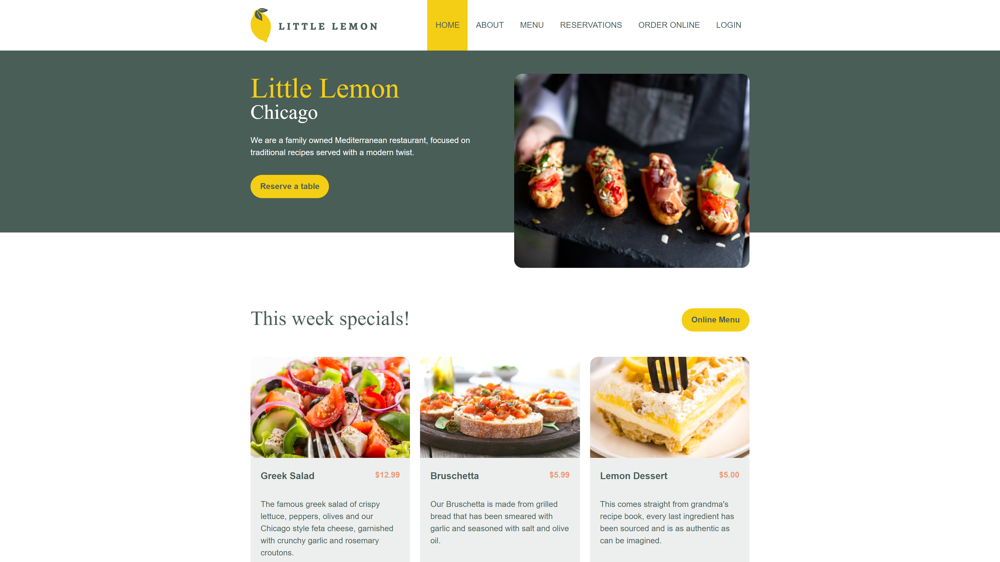

# Little Lemon Restaurant Online Reservation System

Welcome to the Little Lemon Restaurant Online Reservation System! This project is the capstone project for the Meta Front End Development course and is developed using React hooks, HTML, and CSS.

## Table of Contents

- [Introduction](#introduction)
- [Features](#features)
- [Usage](#usage)
- [Technologies Used](#technologies-used)

## Introduction

The Little Lemon Restaurant Online Reservation System is a web application that allows customers to easily make reservations for their dining experience at our restaurant. This system simplifies the reservation process, helping both customers and restaurant staff manage their bookings efficiently.

## Features

- User-friendly interface for making reservations.
- Date and time selection for reservations.
- Real-time availability status for tables.
- Confirmation and cancellation of reservations.
- Responsive design for a seamless experience on various devices.

## Usage

1. Visit the live demo of the application or run it locally following the installation steps.

2. Navigate to the reservation page.

3. Select the desired date and time for your reservation.

4. Check the availability status for tables.

5. Fill in your details and confirm the reservation.

6. You can also cancel a reservation if needed.

Enjoy your dining experience at Little Lemon Restaurant!

## Technologies Used

- React
- HTML
- CSS
- React Hooks

---
